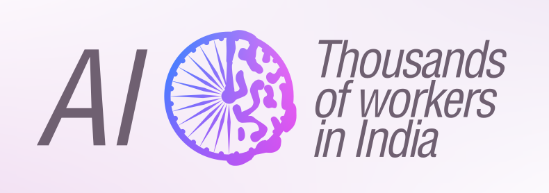

# Artificial Intelligence (AI) as what it really means

Chrome extension that replaces the letters "A I" with what it really means.

[Direct download of crx file](https://github.com/sabslikesobs/ai-to-workers-in-india/blob/master/Extension.crx?raw=true)
You may have to download the file from a different browser because Chrome insists on treating you like a crippled retarded child and will block the download.

## Installation

In Chrome, choose Tools > Extensions. Drag Extension.crx into the page that appears.

## Samples

- News about AI
- AI News & Artificial Intelligence | Techcrunch
- The 7 Biggest Artificial Intelligence (AI) Stories of This Year
- OpenAI unveils newest AI model, GPT-4o
- OpenAI Wants AI to Help Humans Train AI
- Google I/O: AI is Embedded in Search, Buuilding On...
- AI now beats humans at basic tasks
